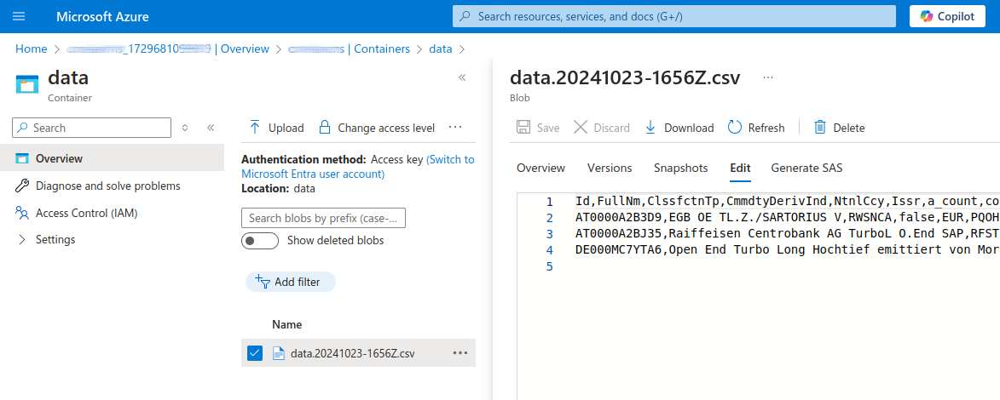
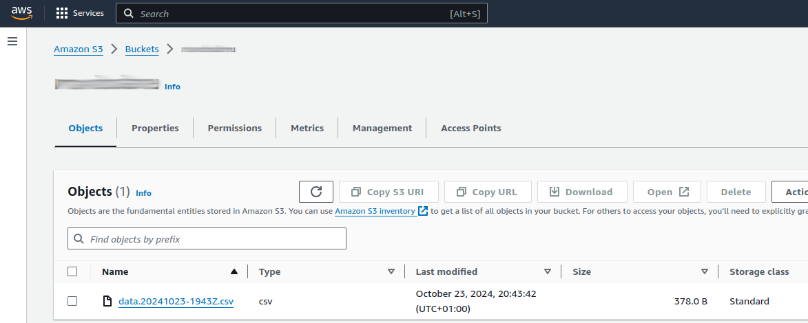

# csv-with-fsspec

Load CSV, transform using Pandas, store via pandas and fsspec

This project loads a zip file from a remote location, unpacking and transforming
its content using Pandas and other Python dependencies. After data transformation,
a CSV file is stored locally, or in Azure. See the [Setup](#setup) chapter
to enable different storages.


## Setup

The [env.toml](env.toml) file must be updated to enable several settings. The basic ones are here explained:

```
SOURCE_XML_URL (str): The URL for the first XML to be fetched. The ZIP file will be fetched from this XML.
DOWNLOAD_LINK_INDEX (int): The index be used to find the URL to the ZIP file inside the first XML.

STORAGE_LOCAL_DIR (str): Relative or absolute path to store the CSV file. If the directory does not exit, it will be created.

STORAGE_AZURE_CONNECTION_STRING_FILEPATH (str): Path to a file having an Azure Blob connection string. This file must be in mode 600 (rw,-,-)
STORAGE_AZURE_CONTAINER_NAME (str): Name of the container to store the CSV file.

STORAGE_AWS_SECRET_FILEPATH (str): Path to a file having an AWS connection secret. This file must be in mode 600 (rw,-,-)
STORAGE_AWS_KEY_STRING (str): The key to the AWS account.
STORAGE_AWS_BUCKET_NAME (str): Name of the bucket to store the CSV file.

ENABLE_STDOUT_LOG (bool): Higher-level logs can be printed to stdout. This is ideal in case this App runs as a systemctl daemon.
```

### Developer setup

> Note: in case your system does not use make, please open the [Makefile](Makefile) and run each command
> manually from the targets here listed.

```shell
make env-setup
```


## Run the App

_TBD_


## Reports

### Local storage

```shell
data/
├── data.20241023-1431Z.csv
├── data.20241023-1655Z.csv
└── data.20241023-1656Z.csv
```

### Azure storage



### AWS S3



### Logs

_TBD_


## todo's

- [ ] Unit test Extractor.parse_package_content
- [ ] Fully unit test remote Storage (mocking the connection)
- [ ] Find a way to cancel the Azure tests in case the connection fails (thread timeout was tried)
